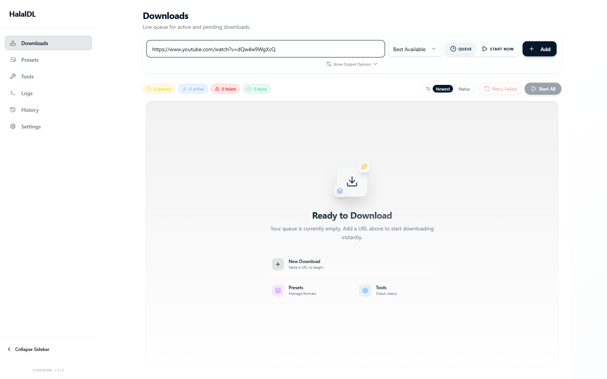
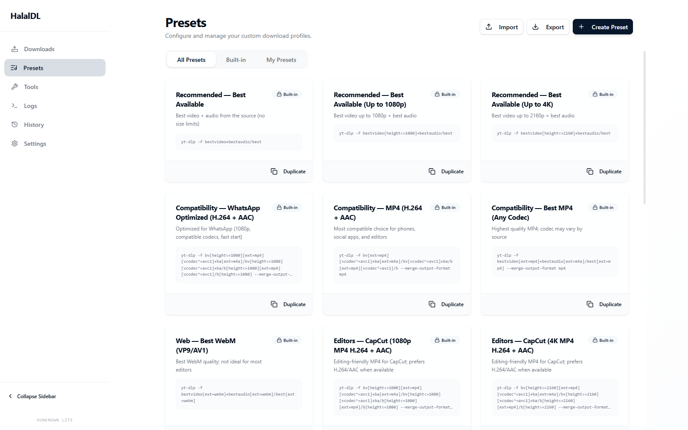
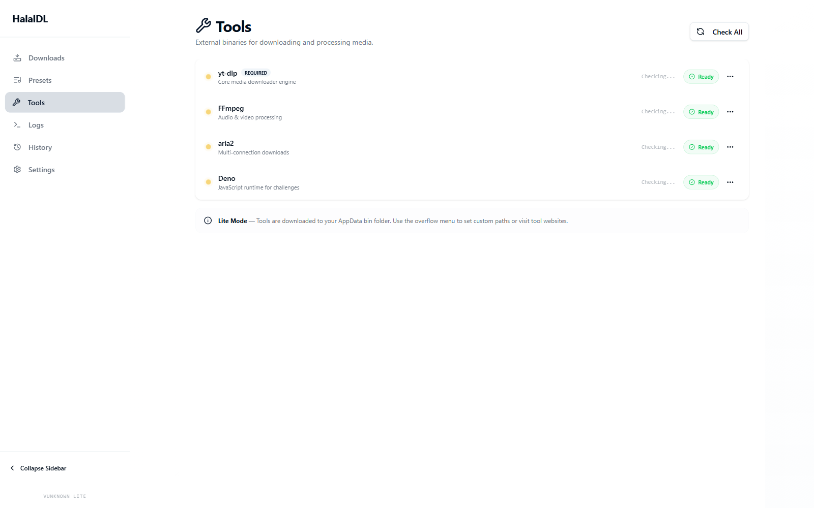
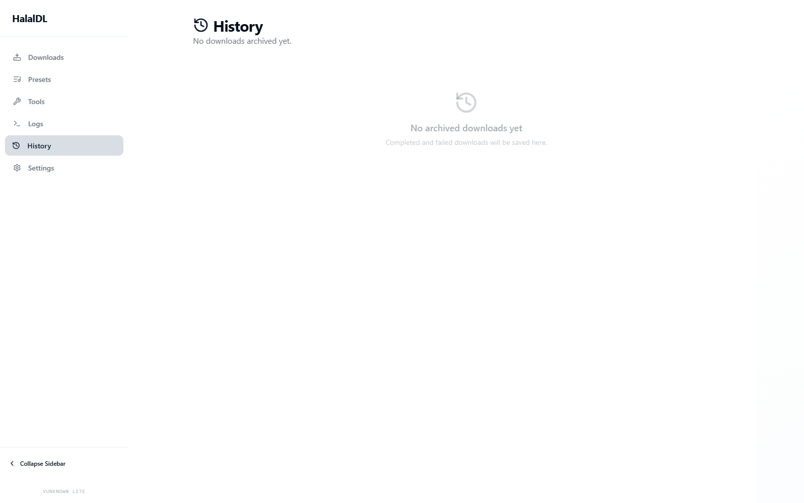
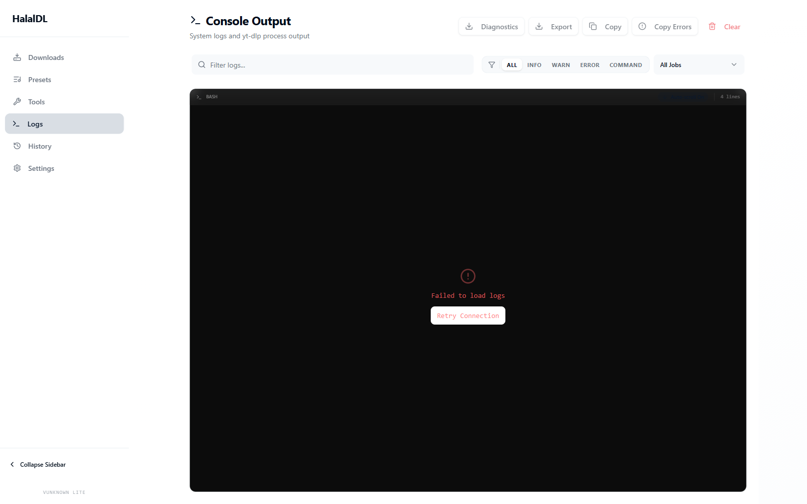

# HalalDL

Windows-first, local-first desktop downloads for people who want a clean GUI on top of `yt-dlp`.

[Official website](https://halaldl.vercel.app) • [Download the latest release](https://github.com/Asdmir786/HalalDL/releases/latest) • [Report a bug](https://github.com/Asdmir786/HalalDL/issues/new/choose) • [Get support](./SUPPORT.md) • [Read the docs](./docs)

## Start Here

HalalDL is a privacy-focused Windows desktop app for downloading video or audio with presets, raw logs, and optional bundled tools.

- **Best for most users:** download the latest release and choose `HalalDL-Full-...-setup.exe`
- **Best for power users:** choose `HalalDL-Lite-...-setup.exe` if you want to manage `yt-dlp`, `ffmpeg`, and optional tools yourself
- **WinGet:** `winget install --id Asdmir786.HalalDL`
- **Platform today:** Windows 10 and Windows 11, x64
- **Use it responsibly:** only download content you are allowed to access and save; respect platform rules, copyright, and local law

WinGet catalog updates can lag behind GitHub Releases, so the latest GitHub release is the fastest path to a new version.

## Why People Try HalalDL

- **Local-first:** no account, no tracking, no cloud dependency
- **Beginner-friendly:** paste a URL, pick a preset, and go
- **Fast clipboard flow:** quick tray downloads and auto-paste keep repeat downloads moving
- **Transparent:** raw logs stay visible instead of being hidden behind vague progress messages
- **Flexible:** Full and Lite builds let you choose between convenience and control

## Why This Exists

HalalDL exists because a lot of Windows users want the power of `yt-dlp` without living in a terminal or hunting through scattered setup steps.

The project tries to keep the strong parts of the CLI ecosystem while making the daily workflow clearer:

- sane presets
- visible logs
- obvious installer choices
- no account system or telemetry layer

## Screenshots

### Downloads



### Presets



### Tools



### History



### Logs



## Download Flow

1. Paste a video or playlist URL.
2. Pick a preset or keep the default.
3. Choose whether to queue it or start immediately.
4. Watch live progress and raw logs.
5. Find completed files and past activity in History.

## Full vs Lite

| Build | Best for | Includes tools | Notes |
| --- | --- | --- | --- |
| **Full** | Most users | Yes | Recommended if you want the easiest install path |
| **Lite** | Power users | No | Use your own `yt-dlp`, `ffmpeg`, `aria2`, and optional Deno runtime |

## Install Trust And SmartScreen

HalalDL releases are currently **not code-signed**, so Windows SmartScreen may warn on first run.

- Download from the official [GitHub Releases](https://github.com/Asdmir786/HalalDL/releases/latest) page only
- Verify the installer against the `SHA256SUMS.txt` file attached to each release
- If SmartScreen appears, use `More info` and confirm the publisher/source only if the checksum matches the release page

The repo is public so you can inspect the source, workflows, and release process before installing.

## Features

- High-quality video and audio downloads from supported platforms
- Built-in presets for common formats, devices, and subtitle workflows
- Quick tray downloads with clipboard-aware preset launching
- In-app release checks with verified update downloads
- Better Instagram support including carousel and image-only handling
- Full transparency through raw `yt-dlp` output
- Tools management for `yt-dlp`, `ffmpeg`, `aria2`, and optional runtime support
- Download history with media-focused organization
- Lite and Full packaging for different comfort levels

## FAQ

### Is HalalDL a cloud service?

No. HalalDL is a local desktop app.

### Which build should I choose?

Choose **Full** if you want the easiest setup. Choose **Lite** if you prefer managing your own tools.

### Does HalalDL support macOS or Linux?

Not in the current release path. The project is Windows-first right now.

### Is this code-signed?

Not yet. That is why the README and release process include SmartScreen and checksum guidance.

## Current Scope

- Windows-first desktop app
- Tauri v2 + React + TypeScript frontend
- Local JSON storage, no login system, no telemetry

## Development

### Stack

- [Tauri](https://tauri.app/)
- [React](https://react.dev/)
- [TypeScript](https://www.typescriptlang.org/)
- [Vite](https://vitejs.dev/)
- [Tailwind CSS](https://tailwindcss.com/)
- [shadcn/ui](https://ui.shadcn.com/)

### Commands

```bash
pnpm install
pnpm dev
pnpm lint
pnpm typecheck
pnpm check
pnpm build:lite
pnpm build:full
```

## Contributing

Small fixes, UX polish, packaging improvements, and bug reports are all welcome.

- Read [CONTRIBUTING.md](./CONTRIBUTING.md)
- Use [GitHub Issues](https://github.com/Asdmir786/HalalDL/issues/new/choose) for bugs and feature requests
- Use [SECURITY.md](./SECURITY.md) for vulnerability reporting guidance

## Support

- Usage help: [SUPPORT.md](./SUPPORT.md)
- Release packaging notes: [docs/08-packaging.md](./docs/08-packaging.md)
- Product overview: [docs/01-overview.md](./docs/01-overview.md)

## License

[MIT](./LICENSE)
