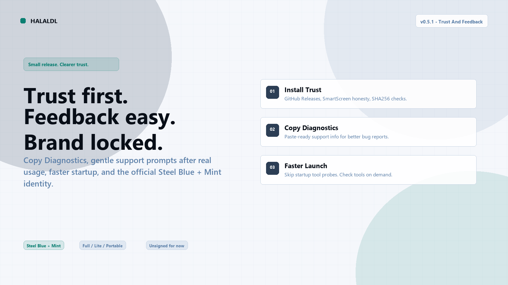
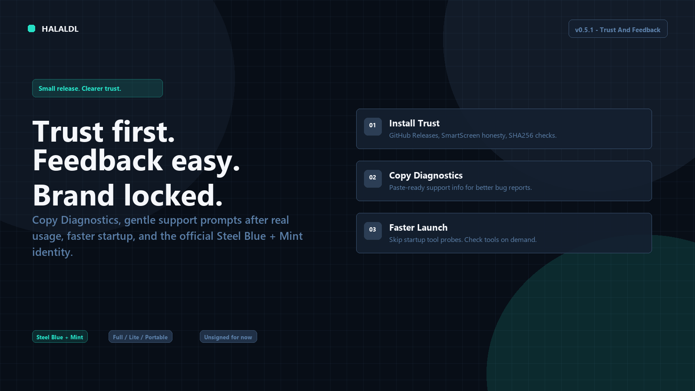
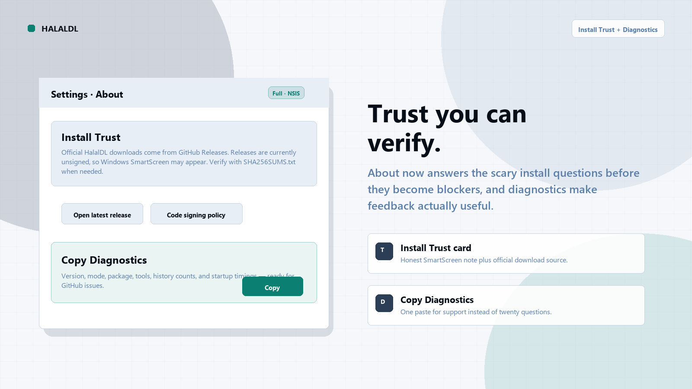
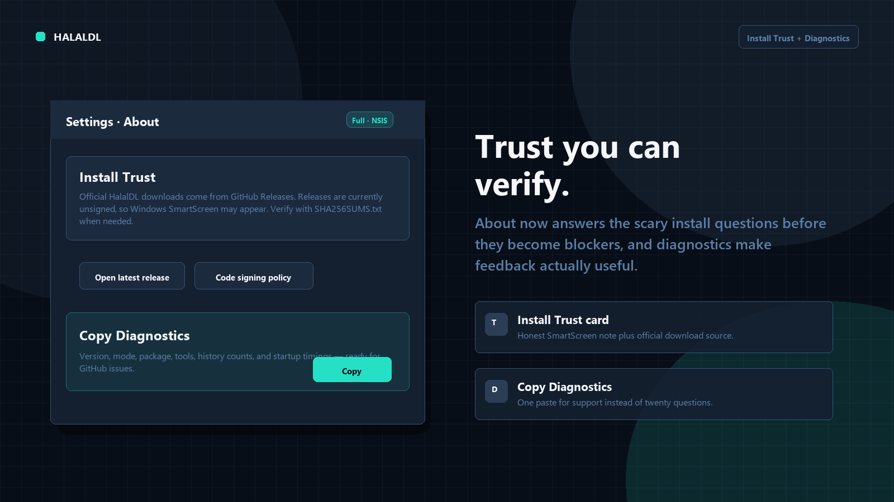
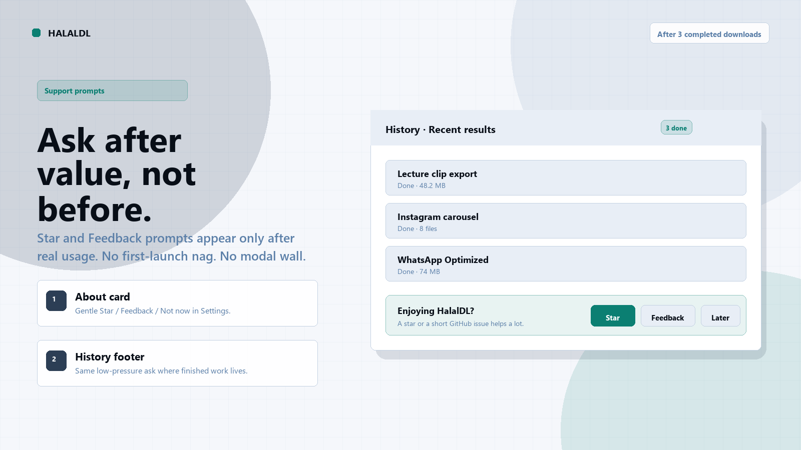
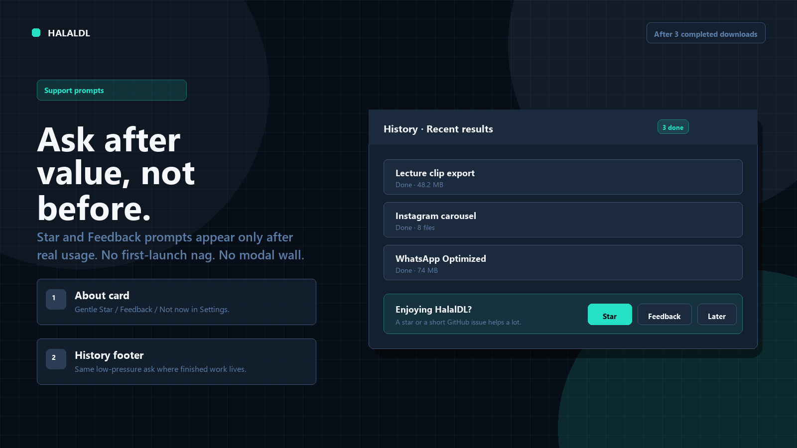
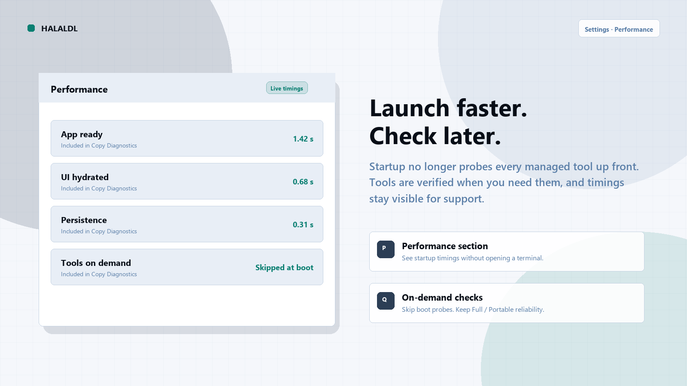
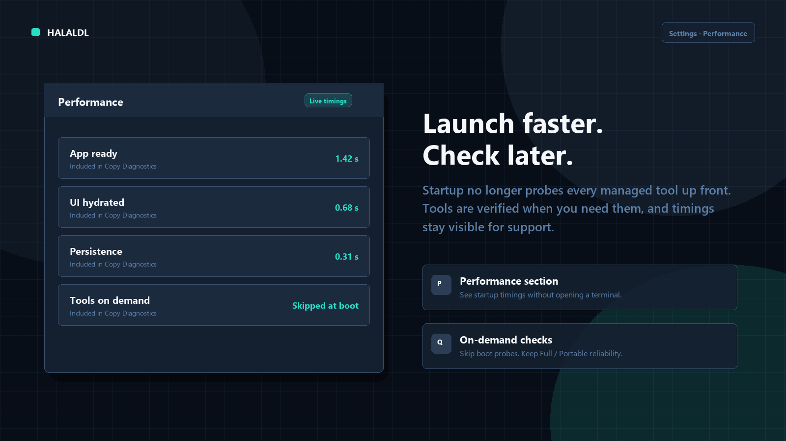
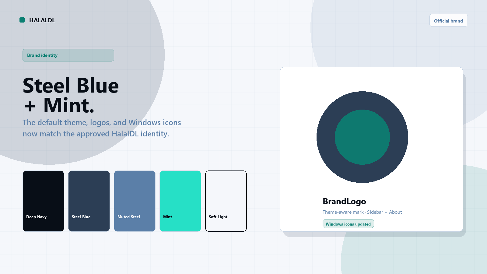
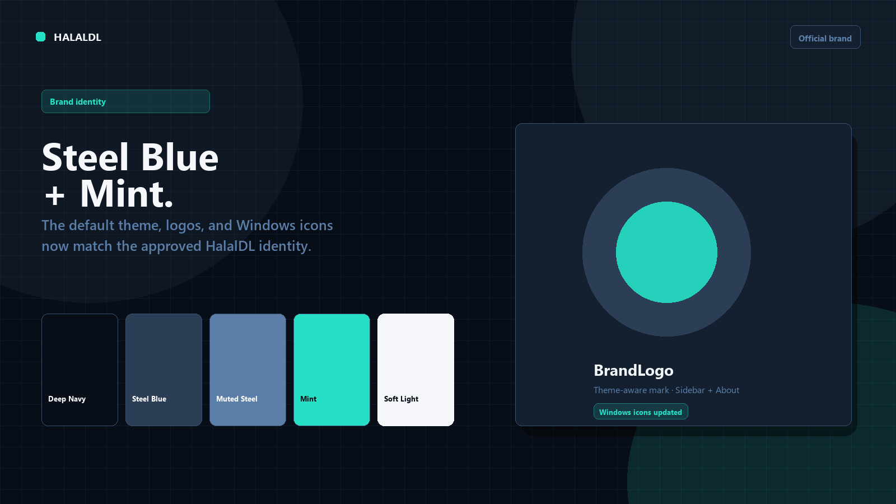

# v0.5.1 - The Trust And Feedback Update

Released: 2026-07-26

## The "Trust And Feedback" Update!

HalalDL v0.5.1 makes install trust clearer, feedback easier, and startup faster — while shipping the official Steel Blue + Mint brand. Copy Diagnostics, gentle support prompts after real usage, and hardened tool checks are the daily-driver wins in this release.

## What's New in v0.5.1?

### Trust and support

*   **Support prompts**: After three completed downloads, Settings/About and History gently offer Star, Feedback, and Not now — no first-launch nag, no modal interruption.
*   **Install Trust card**: About now explains that official downloads come from GitHub Releases, that releases are still unsigned, and how to verify with `SHA256SUMS.txt`.
*   **Copy Diagnostics**: One click copies version, mode, package type, tool status, history counts, and startup timings for better bug reports.

### Faster startup and clearer performance

*   **On-demand tool checks**: Startup no longer probes every managed tool up front; checks run when you need them.
*   **Settings → Performance**: See startup timings in-app and include them when copying diagnostics.
*   **ASAP URL autofill**: Quick paste flows keep unique clipboard URLs ready without fighting the input.

### Official Steel Blue + Mint brand

*   **Locked palette**: Default theme maps to the approved Steel Blue + Mint identity.
*   **BrandLogo**: Theme-aware mark in Sidebar and About.
*   **Windows icons**: Regenerated Tauri/Windows icon assets from the approved transparent marks.

## Fixes & Improvements

*   **Tools**: Hardened yt-dlp checks to avoid hangs; Full/Portable require reinstall when managed yt-dlp is missing.
*   **FFmpeg**: Prefer GitHub FFmpeg mirrors for portable and CI packaging paths.
*   **Menus / errors**: Clearer tool and download error surfaces with copy actions.
*   **Logs / Downloads**: Tighter UI states, import fixes, and support-info polish.

## Choosing Your Version

*   **Full (Recommended)**: Best for most users. Includes all dependencies (FFmpeg, yt-dlp, etc.) pre-configured.
*   **Lite**: Best for power users who manage their own tools.
*   **Portable**: Best for no-install or locked-down Windows setups. Keeps app data and managed tools beside the executable.

## Known Notes

*   **Portable updates**: Portable builds still update manually from GitHub Releases (no in-app self-updater).
*   **Install trust**: Releases are still unsigned, so Windows SmartScreen may appear on first run. Verify downloads with `SHA256SUMS.txt` when needed. See `CODE_SIGNING_POLICY.md`.
*   **Release images**: Light-mode and dark-mode release images are included as separate pairs.

## Upgrade Notes

*   Existing settings, presets, downloads, and history should carry forward normally.
*   After three completed downloads you may see the new support prompts; dismiss with Not now, Star, or Feedback.
*   Full and Lite users can keep using the normal installer-based release path; Portable users should replace the folder with the new ZIP.

## Note from the Developer

This release is about trust you can verify and feedback that does not get in the way. Faster startup and the official brand are part of that same goal: HalalDL should feel safe to install, easy to report issues against, and clearly itself when it opens.

---

Full Changelog: [v0.5.0...v0.5.1](https://github.com/Asdmir786/HalalDL/compare/v0.5.0...v0.5.1)
Built with love using Tauri, React, and Rust.
