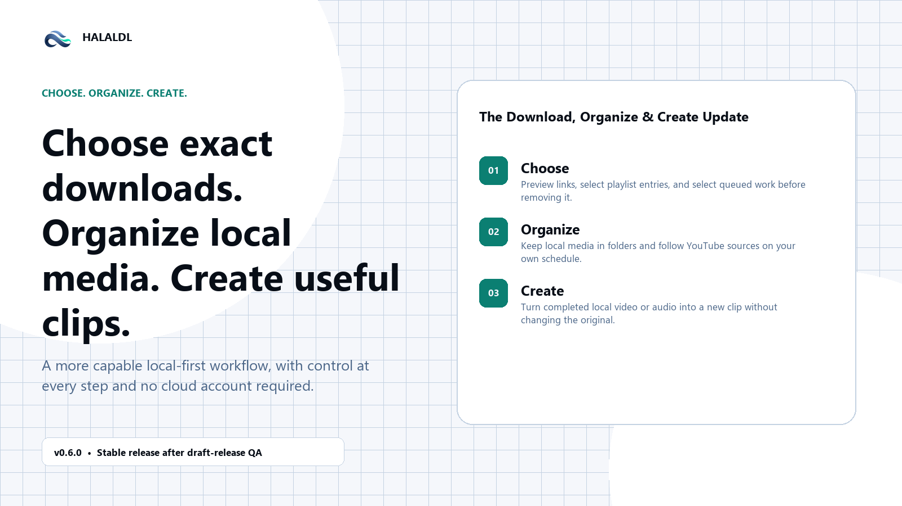
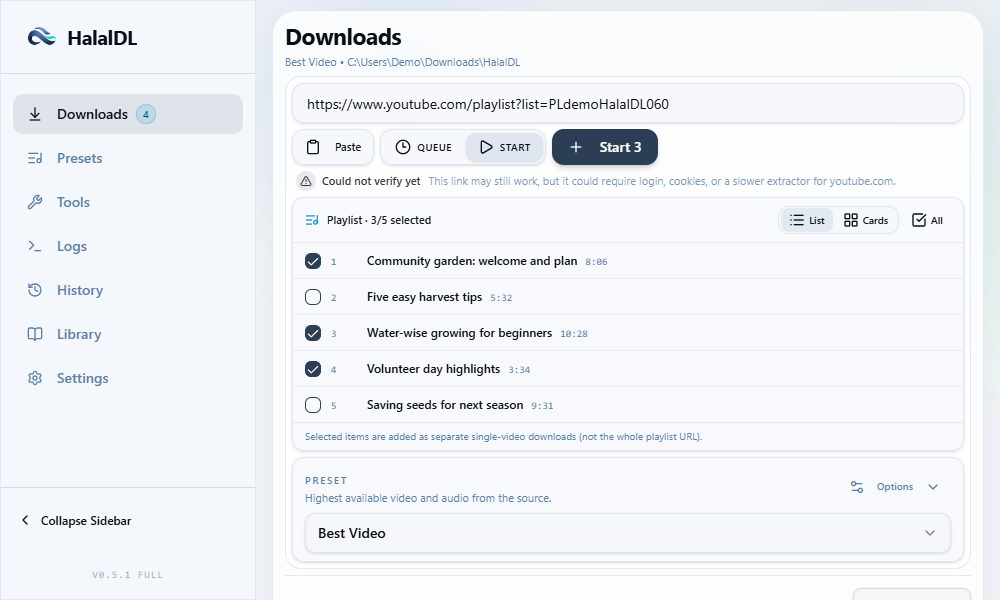
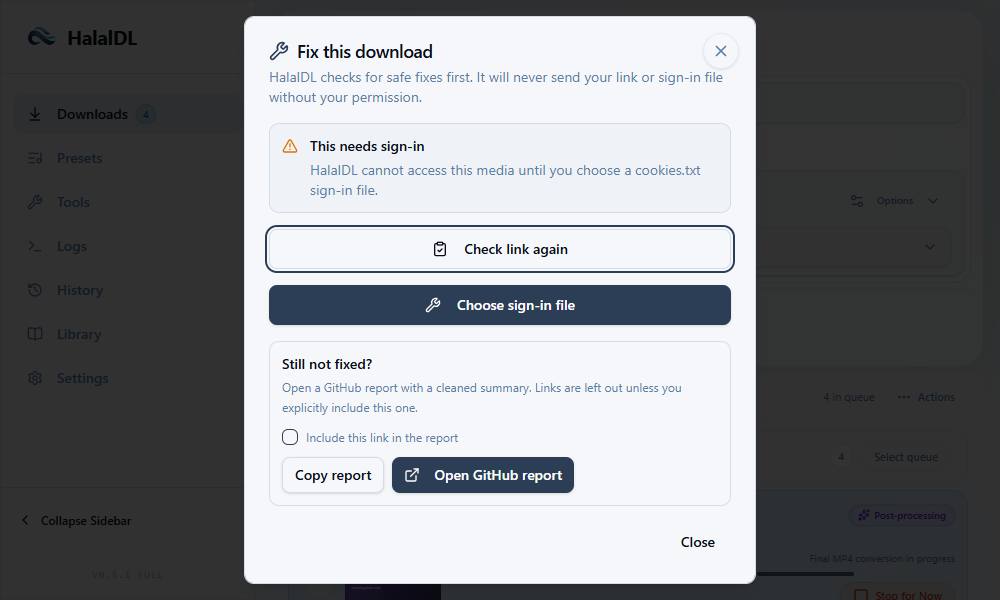
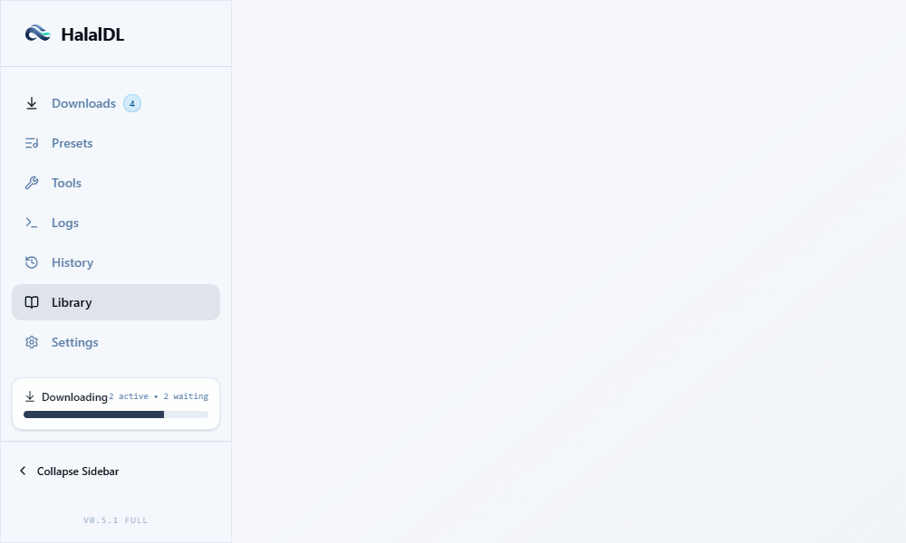
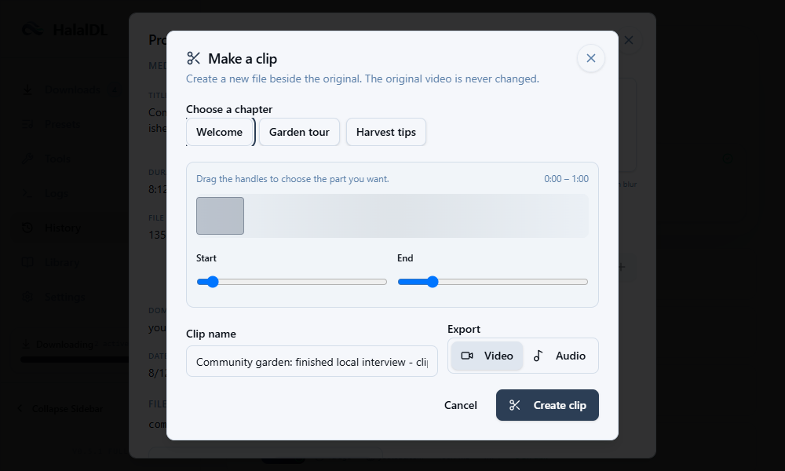

# HalalDL v0.6.0 — The Download, Organize & Create Update

Choose exactly what to download, recover from common failures, organize what you keep, follow sources on your schedule, and create clips from completed media.



## Download with more control

- Preview supported links before starting work, then choose individual playlist entries instead of accepting every item.
- Use cookies where a source requires a signed-in session, preserve SponsorBlock choices, and use the improved Instagram engine when it is the right recovery path.
- Select queued downloads deliberately, then remove or retry the selected set with a clear summary.



## Recover without guessing

- Download Doctor turns common failures into plain-language, safe next steps.
- aria2 fallback and clearer Full/Portable tool detection help reduce avoidable setup friction.



## Organize and create

- Keep local media in Library folders and edit YouTube follows whenever the source, schedule, delivery mode, folder, or preset changes.
- Six hours is recommended for most follows; choose another interval when the source needs it.
- Create clips from completed local media, use retained chapters to find the right range, and preserve the original file.
- Square album art is now a per-preset choice rather than a global audio setting.





## Fixes and polish

- Refined the quick panel and clipboard behavior.
- Improved package reliability and dependency maintenance.
- Tightened queue, download, and local-library guidance so everyday controls are easier to understand.

## Important limits and upgrade notes

- Watchlists check only while HalalDL is open or running in the tray. Six hours is a recommendation, not a requirement.
- Source-platform availability can vary. A source may require cookies or may temporarily block automated access.
- Full and Lite installers remain unsigned; Windows SmartScreen may appear. Verify the checksum before running a release asset when you need that assurance.
- Portable updates are manual: extract the new ZIP into a fresh folder, then bring over only the data you want to retain. Do not overwrite a running Portable folder.
- Full is the best default for most Windows users. Use Lite when you prefer less bundled tooling. Use Portable for a self-contained folder and manual updates.

## Verification

After the GitHub release is published, download `SHA256SUMS.txt` with the chosen asset and verify it in PowerShell:

```powershell
Get-FileHash .\HalalDL-Full-v0.6.0-win10+11-x64-setup.exe -Algorithm SHA256
```

Compare the resulting hash with the matching entry in `SHA256SUMS.txt`.

## Developer note

This release keeps the downloader local-first. Marketing fixtures are deterministic fictional data used only for screenshots; they do not fetch a platform, inspect a real cookie file, or use a real media path.

Compare: `v0.5.1...v0.6.0` after the release tag exists.
