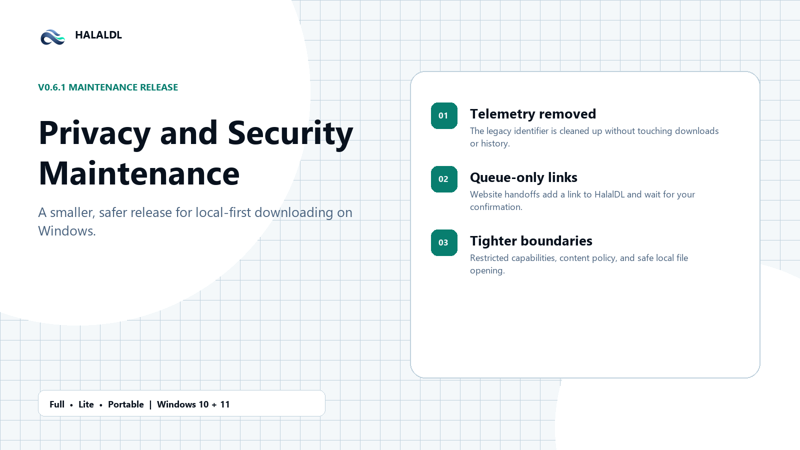

# HalalDL v0.6.1 — Privacy and Security Maintenance

This maintenance release removes the app's legacy telemetry path, makes website-to-app links queue-only by default, and tightens the desktop security boundary. Your downloads, history, presets, settings, and local media remain intact.



## Privacy maintenance

- Removed desktop telemetry collection and transmission.
- Deletes only the legacy `telemetry.json` identifier file during startup cleanup.
- Does not delete download history, presets, settings, cookies, completed files, or other local media.

## Safer website-to-app links

- `halaldl://download?url=...` now adds a valid HTTP or HTTPS link to the queue without starting it automatically.
- Automatic starting requires the explicit `start=1` parameter.
- Invalid schemes, embedded credentials, malformed input, and oversized URLs are rejected.
- Deep links are handled as untrusted input and are not included in telemetry.

## Desktop hardening

- Tightened the Tauri content security policy and window capability permissions.
- Restricted file-opening behavior to approved local paths and supported targets.
- Preserved the existing local-first download, queue, history, preset, and library workflows.

## Before you install

- **Full** is recommended for most Windows users and includes the broadest bundled tool support.
- **Lite** is smaller and expects more supporting tools to be managed separately.
- **Portable** is a self-contained folder and updates by extracting a new ZIP rather than overwriting a running copy.
- Installers are currently unsigned, so Windows SmartScreen may appear. Use `SHA256SUMS.txt` to verify your chosen asset when you need checksum assurance.

## Verification

Download `SHA256SUMS.txt` beside your chosen asset, then verify it in PowerShell. For example:

```powershell
Get-FileHash .\HalalDL-Full-v0.6.1-win10+11-x64-setup.exe -Algorithm SHA256
```

Compare the resulting hash with the matching entry in `SHA256SUMS.txt`.

Compare: `v0.6.0...v0.6.1` after the release tag exists.
